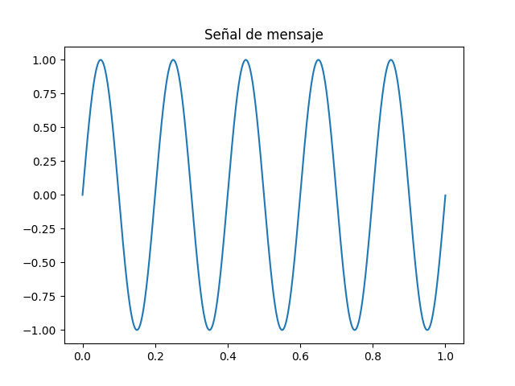
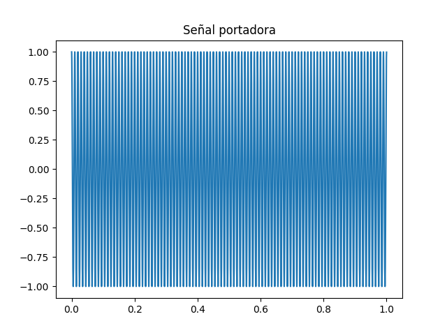
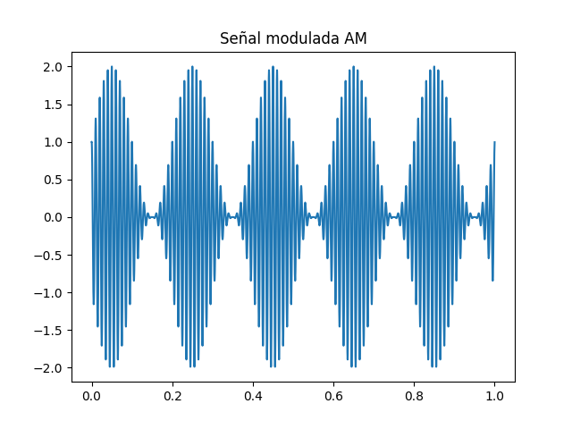
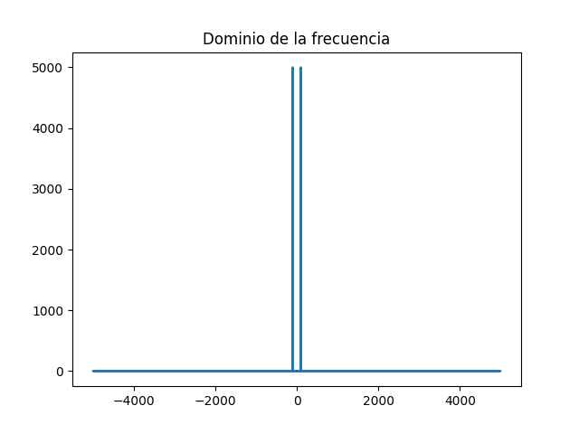
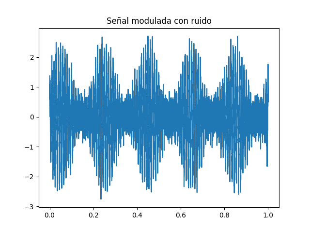
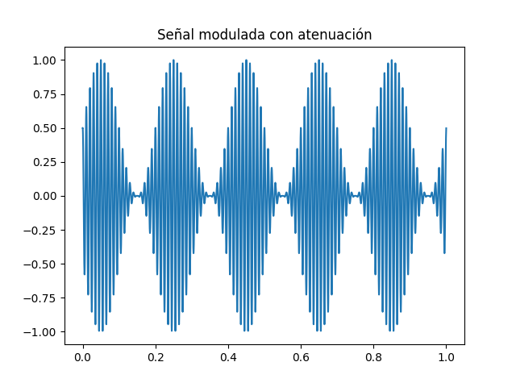

# Modulación en Amplitud (AM)

En este proyecto se implementa un sistema de modulación en amplitud (AM) utilizando Python.

Se genera una señal de mensaje de baja frecuencia y una señal portadora de alta frecuencia.
Posteriormente se realiza la modulación AM para observar cómo la amplitud de la señal portadora
cambia de acuerdo con la señal de mensaje.

También se analiza la señal en el dominio del tiempo y en el dominio de la frecuencia
mediante la Transformada Rápida de Fourier (FFT).

Además, se simula el efecto del ruido y la atenuación sobre la señal modulada,
representando condiciones reales de transmisión en sistemas de comunicación.

## Resultados

### Señal de mensaje

### Señal portadora

### Señal modulada

### Dominio de la frecuencia

### Señal con ruido

### Señal con atenuación

